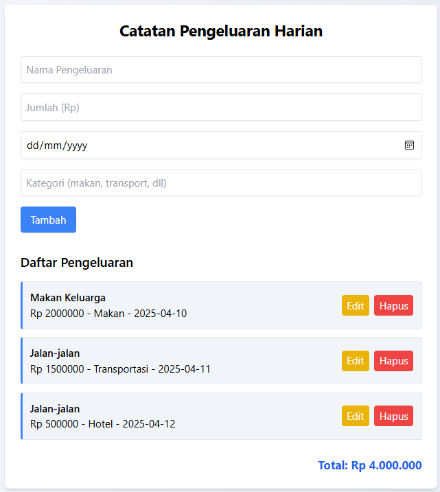

# 💸 Aplikasi Catatan Pengeluaran Harian

## 👤 Identitas
- Nama: Rafi Radiktya Arkan RAZ
- NIM: 122140169
- Kelas: Pemrograman Web - ITERA
- Pertemuan: 3

## 📌 Deskripsi Aplikasi
Aplikasi ini merupakan dashboard sederhana untuk mencatat pengeluaran harian secara offline (disimpan di localStorage).

Pengguna dapat:
- Menambahkan pengeluaran (nama, jumlah, tanggal, kategori)
- Melihat daftar pengeluaran
- Mengedit dan menghapus data
- Melihat total pengeluaran
- Data tetap tersimpan meski halaman di-refresh

## ⚙️ Teknologi & Fitur yang Digunakan
### ✅ HTML + Tailwind CSS
Untuk tampilan antarmuka aplikasi

### ✅ JavaScript Modern (ES6+)
- `let` & `const` untuk deklarasi variabel
- `arrow functions`
- `template literals`
- `class` (`Pengeluaran`)
- `array methods`: `forEach`, `reduce`, `filter`, `findIndex`
- `localStorage` untuk penyimpanan data
- `async/await` (simulasi penyimpanan edit)

## 📁 Struktur Folder
├── index.html
├── css/
│   └── style.css
├── js/
│   ├── app.js      ← class & penyimpanan
│   └── main.js     ← interaksi DOM
└── README.md

## 🚀 Cara Menjalankan
1. Buka file `index.html` di browser (bisa klik kanan → Open with Live Server).
2. Isi form dan klik tombol **Tambah**.
3. Gunakan tombol **Edit** untuk mengubah data.
4. Gunakan tombol **Hapus** untuk menghapus data.
5. Total pengeluaran akan dihitung otomatis.

## 📸 Screenshot

## 📝 Catatan Tambahan
- Semua data tersimpan secara lokal di browser.
- Aplikasi ini dapat dikembangkan lebih lanjut untuk menyimpan data ke server atau export laporan.